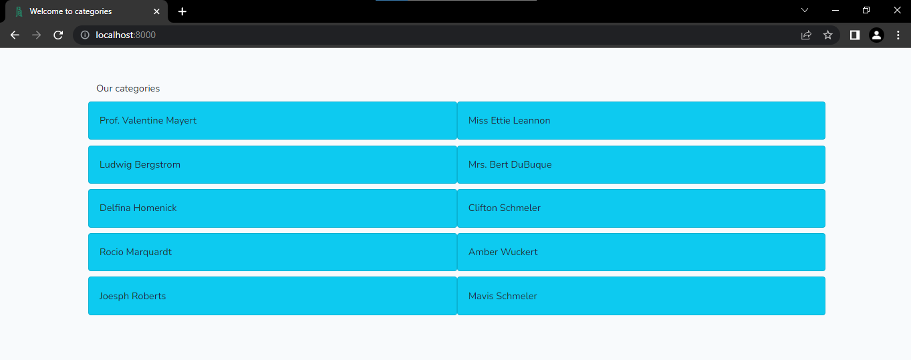

## laravel with vuex


- Simple fetching of data from the server using vuex store and axios request.





## How to use it

- ``` git clone https://github.com/moamahfouz/laravel-vuex```

- ``` composer i ```
- ``` php artisan migrate:fresh --seed ```
- ``` npm i && npm run watch ```
- ``` php artisan serve ```

Then visit http://localhost:8080/
